<a id="readme"></a>
<a href="#readme"></a>

# Smart Parking System with License Plate Recognition

> Embedded + Computer Vision graduation project using Arduino Uno R3, Python, YOLOv8n, PaddleOCR, OpenCV, SQLite, and Tkinter.

<a href="#readme"></a>
<a href="#readme"></a>
<a href="#readme"></a>
<a href="#readme"></a>
<a href="#readme"></a>
<a href="#readme"></a>
<a href="LICENSE"></a>

## <a name="table-of-contents"></a> Table of Contents

- [Overview](#overview)
- [Goals & Scope](#goals--scope)
- [Demo Gallery](#demo-gallery)
- [Project Highlights](#project-highlights)
- [Results & Metrics](#results)
- [Features](#features)
- [Tech Stack](#tech-stack)
- [System Architecture](#architecture)
- [Recognition Pipeline](#recognition-pipeline)
- [Quick Start](#quick-start)
- [Project Structure](#project-structure)
- [Hardware Setup](#hardware-setup)
- [Database](#database)
- [Training & Evaluation Notes](#training-evaluation)
- [Operation Test Results](#operation-test-results)
- [Limitations & Roadmap](#limitations--roadmap)
- [Troubleshooting](#troubleshooting)
- [Author](#author)
- [License](#license)

## <a name="overview"></a> Overview

This project is a smart parking management prototype built for my engineering graduation thesis. The system detects vehicles at the entry/exit gates, captures camera images, recognizes Vietnamese license plates, validates vehicle data in SQLite, controls barrier servos through Arduino Uno R3, and displays live operating status on a Tkinter desktop UI.

The project was designed as an integrated embedded/software system instead of a standalone AI demo. It combines sensors, actuator control, serial communication, computer vision, OCR, database management, and an operator interface.

## <a name="goals--scope"></a> Goals & Scope

| Area | Implementation scope |
|---|---|
| Parking model | 2-gate prototype with entry and exit barriers |
| Operation modes | Automatic and manual operation |
| Hardware scope | Arduino Uno R3, LM393 sensors, SG90 servos, USB camera |
| Software scope | Python desktop application, SQLite database, YOLOv8n + PaddleOCR recognition |
| Safety behavior | Barrier closes after the vehicle has passed the sensor |
| Not included | Payment, web/mobile monitoring, industrial-grade barrier hardware |

## <a name="demo-gallery"></a> Demo Gallery

| Desktop operator UI | Hardware prototype |
|---|---|
| 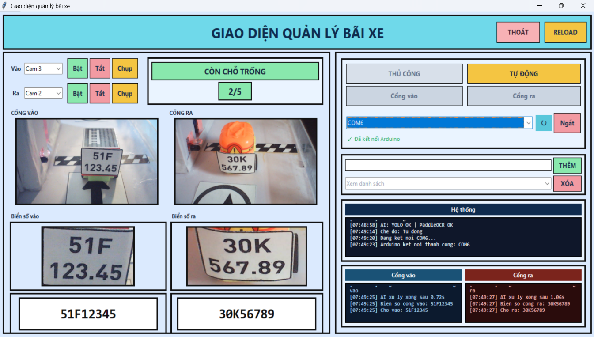 | 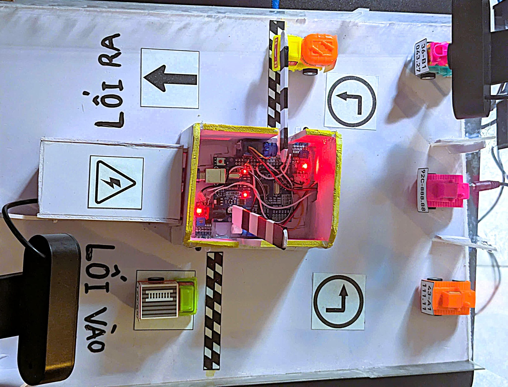 |

| System operation flow | Software module architecture |
|---|---|
| 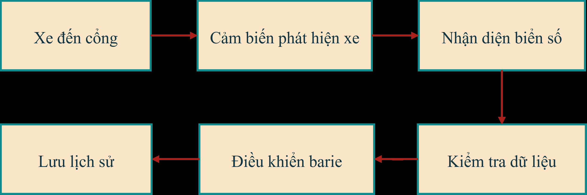 | 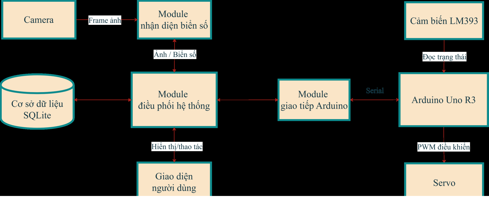 |

| Hardware wiring diagram | Database module architecture |
|---|---|
| 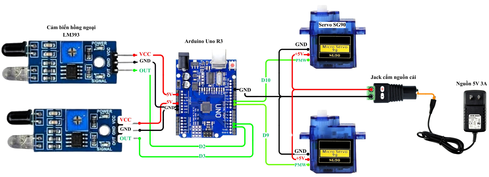 | 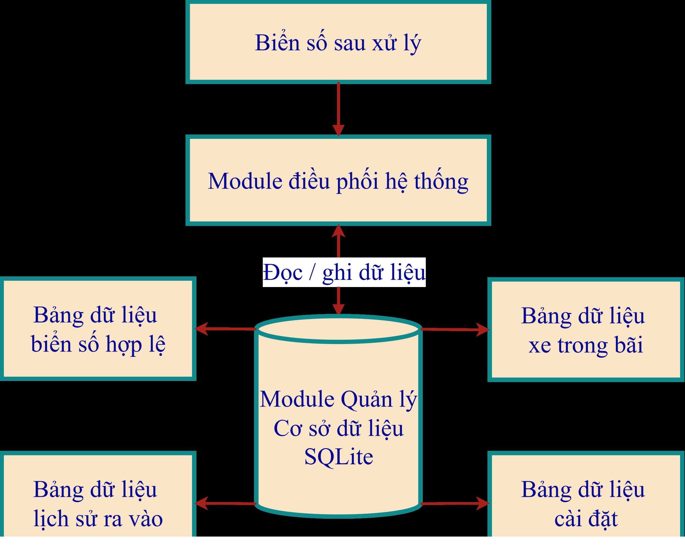 |

| Recognition workflow | OpenCV preprocessing variants |
|---|---|
| 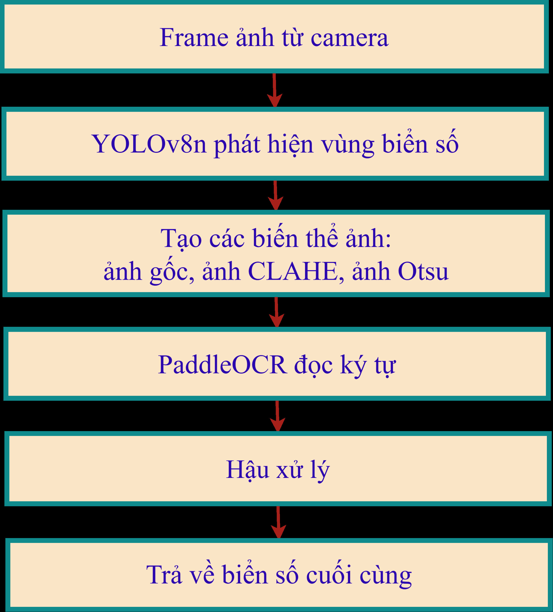 | 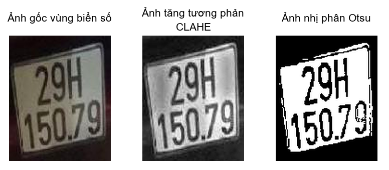 |

## <a name="project-highlights"></a> Project Highlights

- Built Arduino Uno R3 firmware to read LM393 infrared sensors and control servo barriers.
- Implemented UART/Serial communication between the PC application and Arduino.
- Integrated USB camera capture with a Python desktop application.
- Developed a license plate recognition pipeline using YOLOv8n, OpenCV, PaddleOCR, and post-processing.
- Designed an SQLite database for valid plates, parked vehicles, settings, and entry/exit history.
- Built a Tkinter UI for camera preview, recognition result, parking status, COM connection, and system logs.
- Evaluated the recognition module on 200 labeled images and achieved 97.50% plate-level accuracy.
- Verified end-to-end parking scenarios: valid entry, invalid entry, duplicate entry prevention, valid exit, failed recognition handling, and sensor-triggered capture.

## <a name="results"></a> Results & Metrics

### YOLOv8n License Plate Detection

| Metric | Value |
|---|---:|
| Precision | 99.18% |
| Recall | 99.43% |
| mAP50 | 99.48% |
| mAP50-95 | 72.74% |
| Training time | 3 hours 13 minutes |
| Epochs | 100 |
| Image size | 640 |

### Full Recognition Pipeline Evaluation

The complete recognition module was evaluated on 200 manually labeled Vietnamese license plate images.

**Google XYZ summary:** Achieved **97.50% plate-level accuracy**, measured on **200 manually labeled license plate images**, by combining **YOLOv8n region detection, OpenCV preprocessing, PaddleOCR, and Vietnamese plate-specific post-processing**.

| Metric | Value |
|---|---:|
| Total images | 200 |
| Fully correct predictions | 195/200 |
| Plate-level accuracy | 97.50% |
| Character-level accuracy | 98.56% |
| CER | 1.44% |
| YOLO detected plate region | 99.50% |
| OCR produced at least one text candidate | 99.50% |
| Average processing time | 619 ms/image |

Evaluation artifacts are available in:

```text
danh_gia_module_nhan_dien_bien_so/ket_qua_danh_gia_200/
```

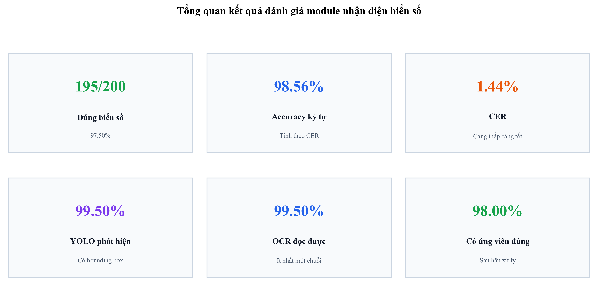

## <a name="features"></a> Features

- Entry and exit vehicle detection using LM393 infrared sensors.
- Automatic and manual operation modes.
- USB camera capture for both entry and exit gates.
- YOLOv8n-based license plate region detection.
- OpenCV preprocessing with original, CLAHE, and Otsu variants.
- PaddleOCR-based character recognition.
- Vietnamese license plate post-processing and candidate ranking.
- Whitelist validation for entry vehicles.
- Exit validation against vehicles currently inside the parking lot.
- SQLite storage for valid plates, parked vehicles, settings, and history.
- Servo barrier control through Arduino commands.
- Tkinter UI for live camera preview, plate result, parking capacity, barrier state, and logs.

## <a name="tech-stack"></a> Tech Stack

<a href="#tech-stack"></a>

| Area | Technologies |
|---|---|
| Embedded | Arduino Uno R3, C/C++ Arduino, LM393 sensors, SG90 servos |
| Communication | UART/Serial, pyserial |
| Application | Python, Tkinter, threading, queue |
| Computer Vision | OpenCV, YOLOv8n, Ultralytics |
| OCR | PaddleOCR, PaddlePaddle |
| Database | SQLite |
| Training/Evaluation | Google Colab, pandas, matplotlib, Jupyter Notebook |

## <a name="architecture"></a> System Architecture

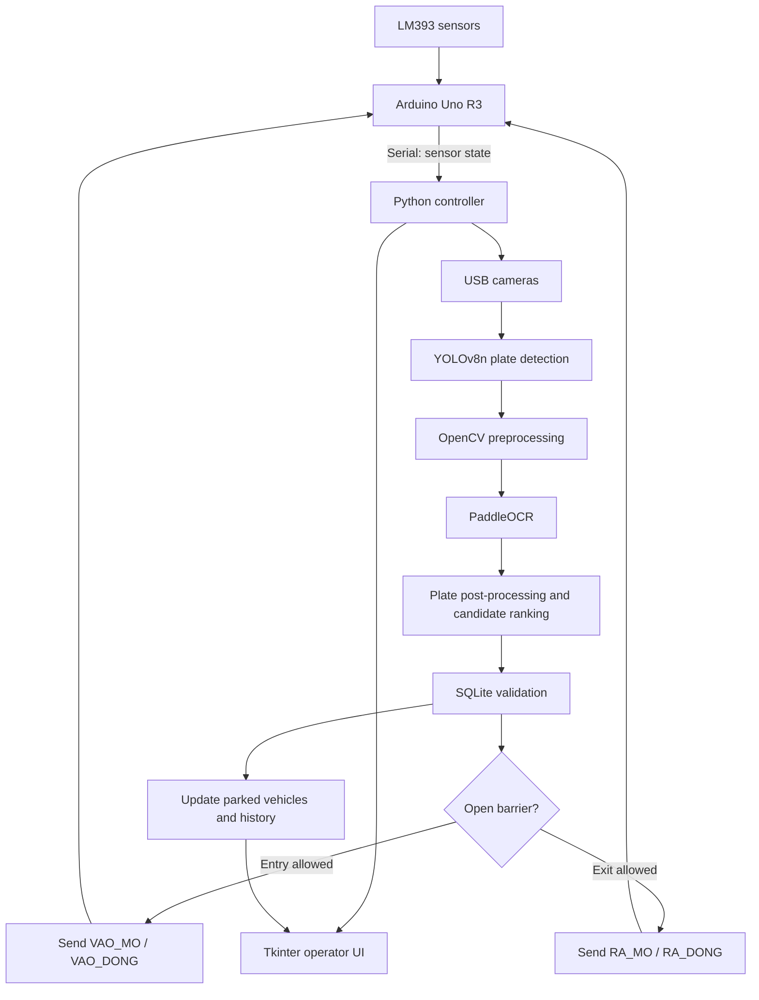

## <a name="recognition-pipeline"></a> Recognition Pipeline

```text
Input frame
  -> YOLOv8n detects license plate region
  -> OpenCV crops the plate area
  -> Create three OCR variants: original, CLAHE, Otsu
  -> PaddleOCR reads text candidates
  -> Normalize A-Z/0-9 characters
  -> Fix common OCR errors by Vietnamese plate character position
  -> Validate plate structure
  -> Rank candidates by structure validity, edit count, frequency, and OCR confidence
  -> Return final plate result
```

YOLO is used only for plate region detection. It does not read characters. Character recognition is handled by PaddleOCR and the final result is selected by custom post-processing in `nhan_dien_bien_so.py`.

Post-processing ranks OCR candidates by structure validity, number of edits, frequency across image variants, and OCR confidence.

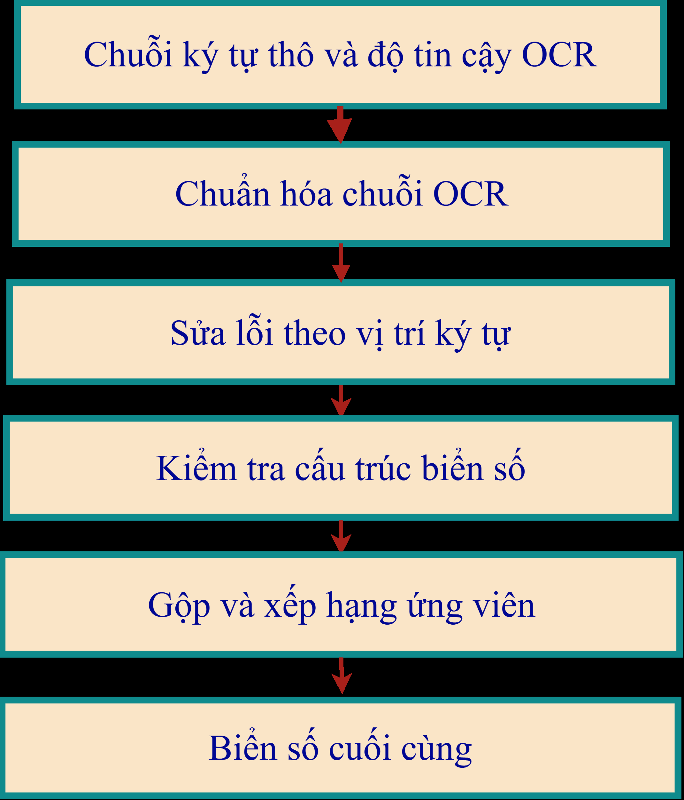

## <a name="quick-start"></a> Quick Start

### Requirements

- Python 3.10 or newer
- Arduino IDE
- Arduino Uno R3
- USB camera
- 2 LM393 infrared sensors
- 2 SG90 servos
- External 5V supply for servos is recommended

### Install Python Dependencies

```powershell
python -m venv .venv
.\.venv\Scripts\activate
pip install -r requirements.txt
```

### Upload Arduino Firmware

Open and upload:

```text
phan_cung_arduino/dieu_khien_barie_lm393/dieu_khien_barie_lm393.ino
```

### Run the Desktop Application

```powershell
python giao_dien_chinh.py
```

On the UI:

1. Select the Arduino COM port.
2. Connect to Arduino.
3. Select camera indexes for entry and exit gates.
4. Add valid license plates to the whitelist.
5. Operate in automatic or manual mode.

## <a name="project-structure"></a> Project Structure

```text
.
├── giao_dien_chinh.py                 # Tkinter operator interface
├── dieu_khien_he_thong.py             # Main controller: camera, AI, DB, Arduino
├── nhan_dien_bien_so.py               # YOLO + OpenCV + PaddleOCR recognition module
├── quan_ly_du_lieu.py                 # SQLite database manager
├── giao_tiep_arduino.py               # Serial communication with Arduino
├── requirements.txt                   # Python dependencies
├── docs/
│   └── images/                         # README visuals extracted from report/presentation
├── mo_hinh/
│   └── bien_so_yolo.pt                # Runtime YOLOv8n model
├── phan_cung_arduino/
│   └── dieu_khien_barie_lm393/
│       └── dieu_khien_barie_lm393.ino # Arduino firmware
├── dataset_train_yolov8n/             # YOLO dataset metadata
├── Kết quả train Yolov8n/             # YOLO training report and artifacts
└── danh_gia_module_nhan_dien_bien_so/ # 200-image evaluation notebook and results
```

## <a name="hardware-setup"></a> Hardware Setup

| Component | Role |
|---|---|
| Arduino Uno R3 | Reads sensors and controls servo barriers |
| LM393 sensor at entry | Detects vehicle at entry gate |
| LM393 sensor at exit | Detects vehicle at exit gate |
| SG90 servo at entry | Simulates entry barrier |
| SG90 servo at exit | Simulates exit barrier |
| USB camera | Captures vehicle/plate image |
| PC/laptop | Runs recognition, database, UI, and system controller |

Arduino firmware uses these command messages:

| Command | Meaning |
|---|---|
| `VAO_MO` | Open entry barrier |
| `VAO_DONG` | Close entry barrier |
| `RA_MO` | Open exit barrier |
| `RA_DONG` | Close exit barrier |
| `PING` | Handshake check |
| `TRANG_THAI` | Request sensor state |

Arduino sends sensor messages in this format:

```text
CAM_BIEN:xe_vao=1,xe_ra=0
```

## <a name="database"></a> Database

The runtime database is SQLite:

```text
co_so_du_lieu_bai_xe.db
```

Main tables:

| Table | Purpose |
|---|---|
| `bien_so_hop_le` | Valid/whitelisted license plates |
| `xe_trong_bai` | Vehicles currently inside the parking lot |
| `lich_su_ra_vao` | Entry/exit history |
| `cai_dat` | System settings such as capacity |

Runtime `.db` files are ignored by Git.

## <a name="training-evaluation"></a> Training & Evaluation Notes

YOLOv8n was trained as a one-class object detector. Class `0` represents the license plate region.

Training dataset metadata:

| Split | Images | Label files | Bounding boxes |
|---|---:|---:|---:|
| Train | 5845 | 5845 | 5989 |
| Valid | 1680 | 1680 | 1710 |
| Test | 832 | 832 | 849 |
| Total | 8357 | 8357 | 8548 |

Training documents:

```text
Kết quả train Yolov8n/
dataset_train_yolov8n/data.yaml
```

Full recognition evaluation:

```text
danh_gia_module_nhan_dien_bien_so/
```

## <a name="operation-test-results"></a> Operation Test Results

| Test scenario | Expected result | Actual result |
|---|---|---|
| Valid vehicle enters | Recognize plate, open barrier, save vehicle inside parking lot | Passed |
| Invalid vehicle enters | Do not open barrier | Passed |
| Vehicle already inside tries to enter again | Reject duplicate entry | Passed |
| Valid vehicle exits | Open barrier, remove from inside list, write history | Passed |
| Recognition fails | Do not open barrier incorrectly | Passed |
| Sensor does not detect vehicle | Do not auto-capture in automatic mode | Passed |

## <a name="limitations--roadmap"></a> Limitations & Roadmap

| Current limitation | Possible improvement |
|---|---|
| Prototype-scale parking model | Upgrade to industrial sensors, camera, lighting, and barrier mechanics |
| LM393 and SG90 are classroom/prototype components | Replace with industrial detection sensors and barrier actuators |
| Recognition depends on camera angle, lighting, and plate condition | Add controlled lighting and collect more difficult samples |
| PaddleOCR was not fine-tuned specifically for Vietnamese plates | Fine-tune OCR or train a plate-specific character recognizer |
| Desktop-only operation | Add web/mobile monitoring, fee calculation, and payment integration |

## <a name="troubleshooting"></a> Troubleshooting

| Problem | Suggested check |
|---|---|
| No COM port appears | Install Arduino driver, reconnect USB cable, reopen the app |
| Arduino does not connect | Check firmware upload and confirm `KHOI_DONG_OK`/`PONG` handshake |
| Camera cannot open | Try another camera index or close other apps using the camera |
| First AI inference is slow | YOLO/PaddleOCR warm-up can take a few seconds |
| Servo is unstable | Use an external 5V power supply for servos |
| Plate not recognized | Improve lighting, camera angle, plate distance, or add more difficult samples |

## <a name="author"></a> Author

**Le Song Thao**<br>
Engineering degree - Electronics and Telecommunications Engineering<br>
Major: Industrial Electronics and Informatics<br>
Graduation thesis score: **9.6/10**

<a href="#readme"></a>

## <a name="license"></a> License

Source code in this repository is released under the [MIT License](LICENSE). If reusing datasets or model weights, please check the license of each original data source.
