# BÁO CÁO PHÂN TÍCH CHI TIẾT HỆ THỐNG QUẢN LÝ BÃI ĐỖ XE TỰ ĐỘNG
**Đề tài:** Hệ Thống Bãi Xe Tự Động Ứng Dụng Nhận Diện Biển Số

Tài liệu phân tích toàn diện về kiến trúc, sơ đồ khối, lưu đồ thuật toán và luồng dữ liệu của hệ thống, dựa trên rà soát mã nguồn thực tế.

---

## 1. TỔNG QUAN HỆ THỐNG

### 1.1. Danh sách file mã nguồn

| File | Vai trò | Dòng code | Đặc điểm nổi bật |
|------|---------|-----------|-------------------|
| `giao_dien_chinh.py` | View (UI) | 487 | Tkinter grid, Polling 100ms, Graceful Shutdown |
| `dieu_khien_he_thong.py` | Controller | 448 | Queue đa luồng, điều phối 3 Thread (AI, Sensor, Camera) |
| `nhan_dien_bien_so.py` | AI Service | 284 | YOLOv8 + PaddleOCR + Heuristics sửa lỗi biển VN |
| `quan_ly_du_lieu.py` | Model (DB) | 110 | SQLite có Thread-Safe Lock + DB Cache |
| `giao_tiep_arduino.py` | HW Service | 95 | pySerial, tự quét cổng COM |
| `dieu_khien_barie_lm393.ino` | Firmware (C++) | 150 | Servo, LM393, chống tràn buffer Serial |
| **Tổng** | | **~1.574** | |

### 1.2. Công nghệ sử dụng

| Thành phần | Công nghệ | Chi tiết |
|------------|-----------|----------|
| Ngôn ngữ | Python 3.12 | Đa luồng (threading) |
| Phát hiện biển số | YOLOv8n | Custom-trained, mAP50: 99.48% |
| Nhận dạng ký tự | PaddleOCR | lang='en', use_angle_cls=False |
| Xử lý ảnh | OpenCV | cv2, CLAHE, Otsu |
| Giao diện | Tkinter | Built-in Python |
| CSDL | SQLite3 | Built-in, file `.db` |
| Giao tiếp phần cứng | pySerial | 9600 baud |
| Vi điều khiển | Arduino Uno | 2 servo + 2 cảm biến LM393 |

---

## 2. SƠ ĐỒ KHỐI TỔNG THỂ

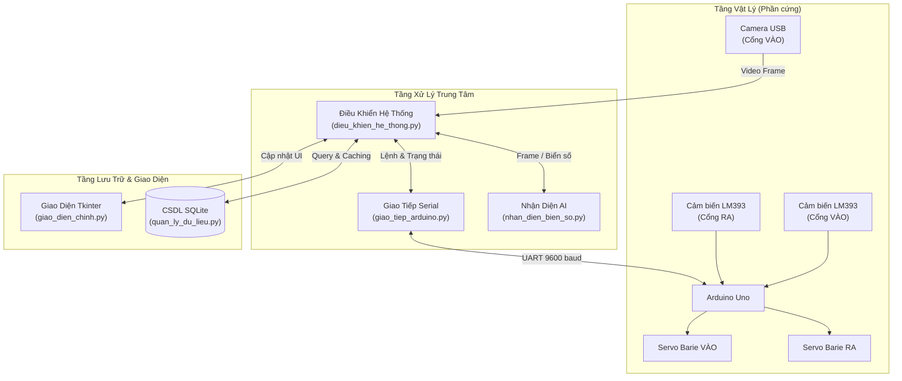

---

## 3. KIẾN TRÚC PHẦN MỀM

### 3.1. Kiến trúc 3 tầng (MVC)

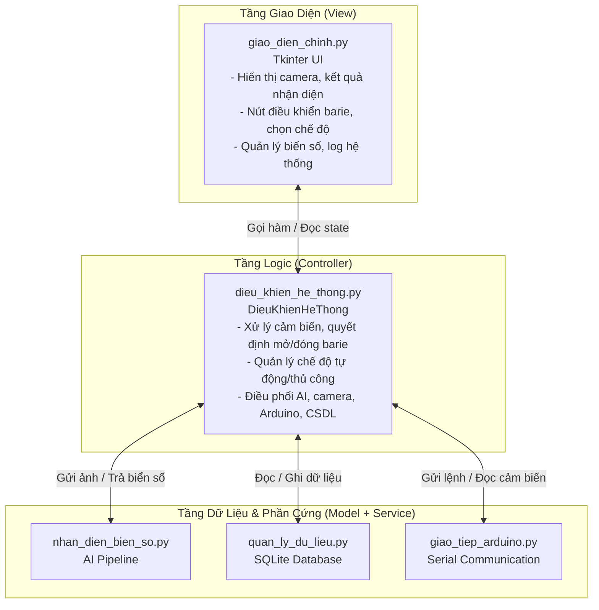

**Nguyên tắc thiết kế:** Giao diện **KHÔNG** truy cập trực tiếp AI, CSDL, hay Arduino. Mọi thao tác đều đi qua `DieuKhienHeThong`. Điều này cho phép thay đổi giao diện (Tkinter → Web) mà không ảnh hưởng logic.

### 3.3. Firmware Arduino (`dieu_khien_barie_lm393.ino`)

Firmware viết bằng C++, chạy trên Arduino Uno, đảm nhận điều khiển phần cứng cấp thấp.

**Sơ đồ chân kết nối:**

| Chân Arduino | Thiết bị | Chức năng |
|-------------|----------|----------|
| Pin 9 (PWM) | Servo cổng VÀO | Góc mở: 90°, góc đóng: 0° |
| Pin 10 (PWM) | Servo cổng RA | Góc mở: 90°, góc đóng: 0° |
| Pin 2 (Digital) | Cảm biến LM393 VÀO | INPUT_PULLUP, tác động mức thấp |
| Pin 3 (Digital) | Cảm biến LM393 RA | INPUT_PULLUP, tác động mức thấp |

**Bảng lệnh Serial (nhận từ máy tính):**

| Lệnh | Hành động | Phản hồi |
|------|-----------|----------|
| `VAO_MO` | Servo VÀO quay 90° | `THONG_TIN:VAO_MO_OK` |
| `VAO_DONG` | Servo VÀO quay 0° | `THONG_TIN:VAO_DONG_OK` |
| `RA_MO` | Servo RA quay 90° | `THONG_TIN:RA_MO_OK` |
| `RA_DONG` | Servo RA quay 0° | `THONG_TIN:RA_DONG_OK` |
| `TRANG_THAI` | Đọc cảm biến | `CAM_BIEN:xe_vao=X,xe_ra=X` |
| `PING` | Kiểm tra kết nối | `THONG_TIN:PONG` |

**Lưu đồ vòng lặp `loop()` của Arduino:**

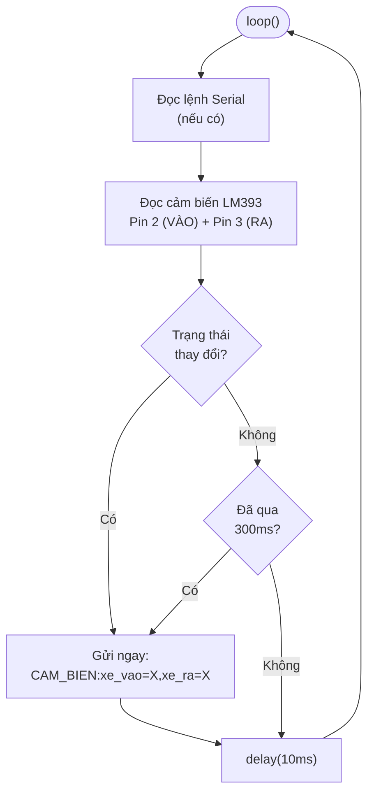

**Đặc điểm kỹ thuật quan trọng:**
- **Chu kỳ gửi trạng thái:** Mỗi 300ms hoặc ngay khi trạng thái thay đổi (event-driven)
- **Chống tràn buffer:** Nếu bộ đệm lệnh > 120 ký tự → reset và gửi `RESET_BO_DEM`
- **Cảm biến tác động mức thấp:** LM393 output LOW khi có vật cản → `docCamBien()` đảo logic
- **Khởi động an toàn:** `setup()` đóng cả 2 barie → đọc cảm biến → gửi `KHOI_DONG_OK`

### 3.2. Sơ đồ đa luồng (Multi-threading)

Hệ thống sử dụng **4 luồng** chạy song song để tránh giao diện bị đơ:

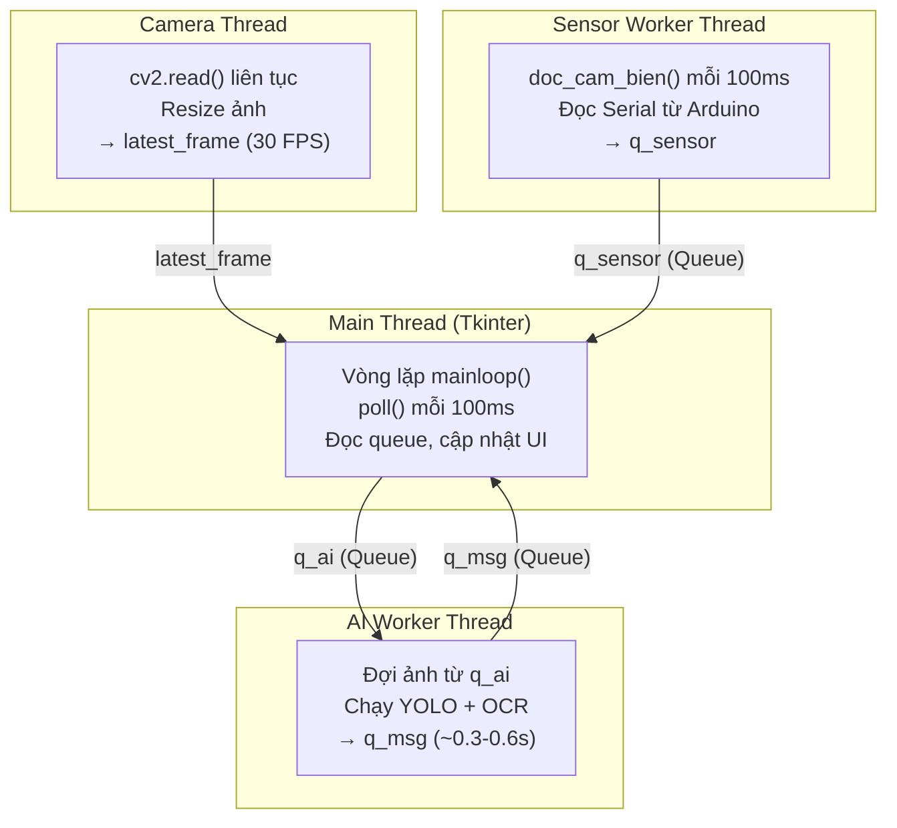

**Giao tiếp giữa các luồng:** Sử dụng `Queue` (thread-safe), không truy cập UI trực tiếp từ thread phụ.

---

## 4. PIPELINE NHẬN DIỆN BIỂN SỐ

### 4.1. Tổng quan pipeline (5 bước)

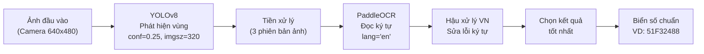

### 4.2. Lưu đồ chi tiết giải thuật AI

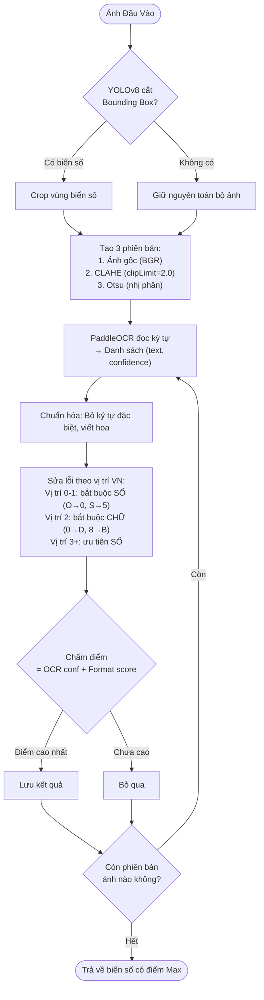

### 4.3. Bảng chấm điểm format biển số VN

| Format score | Regex | Ví dụ |
|-------------|-------|-------|
| 1.0 | `\d{2}[A-Z]\d{5}` | 51H59531 (ô tô) |
| 1.0 | `\d{2}[A-Z]\d{6}` | 36F504327 (xe máy) |
| 1.0 | `\d{2}[A-Z]{2}\d{5}` | 80CD12345 (đặc biệt) |
| 0.9 | `\d{2}[A-Z]{1,2}\d{4,6}` | Biển hợp lệ gần chuẩn |
| 0.5 | `[A-Z0-9]{7,10}` | Đúng độ dài, không rõ format |
| 0.0 | Khác | Không khớp |

---

## 5. LUỒNG DỮ LIỆU

### 5.1. Luồng tự động: Xe VÀO bãi

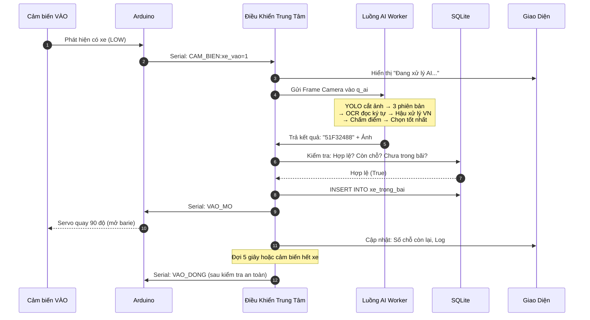

### 5.2. Luồng tự động: Xe RA khỏi bãi

Cổng RA **không có Camera**, không cần nhận diện biển số. Xóa xe theo FIFO.

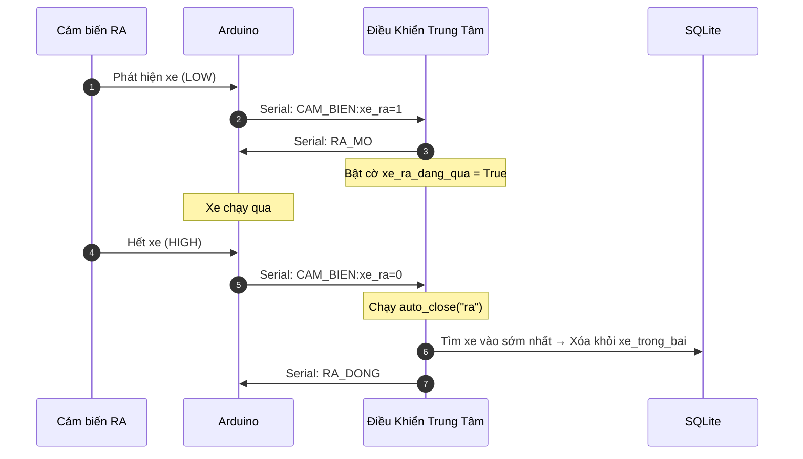

### 5.3. Bảng luồng dữ liệu chi tiết

| Nguồn | Dữ liệu | Đích | Giao thức |
|-------|----------|------|-----------|
| Camera → Main | Ảnh BGR (640×480) | `latest_frame` | OpenCV Thread |
| Main → AI Thread | Ảnh chụp | `q_ai` | Queue |
| AI Thread → Main | Biển số + ảnh | `q_msg` | Queue |
| Arduino → Sensor | `CAM_BIEN:xe_vao=1,xe_ra=0` | `q_sensor` | Serial 9600 |
| Main → Arduino | `VAO_MO` / `RA_DONG` ... | Serial TX | pySerial |
| Logic → SQLite | INSERT/DELETE/SELECT | File `.db` | sqlite3 + Lock |

---

## 6. LƯU ĐỒ THUẬT TOÁN

### 6.1. Lưu đồ hoạt động tổng quát

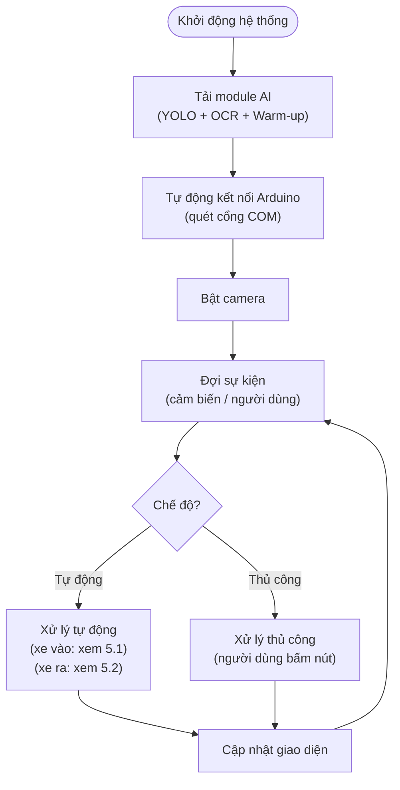

### 6.2. Lưu đồ xử lý xe VÀO (chế độ tự động)

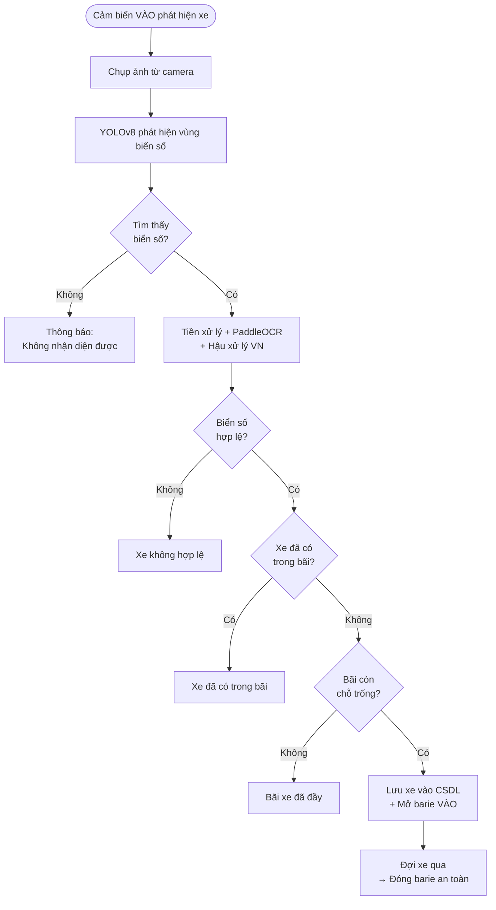

### 6.3. Lưu đồ đóng barie an toàn (Anti-Pinch)

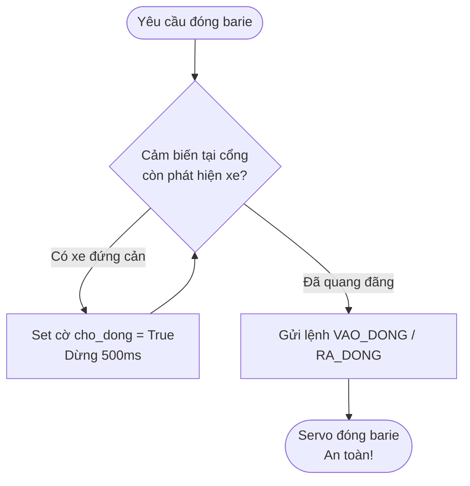

---

## 7. CƠ SỞ DỮ LIỆU

### 7.1. Biểu đồ quan hệ thực thể (ERD)

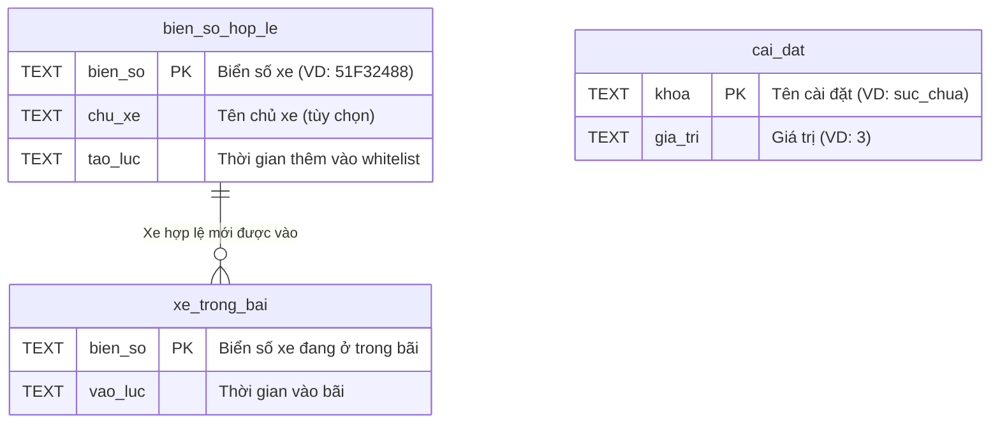

**Đặc tính kỹ thuật:**
- File: `co_so_du_lieu_bai_xe.db`
- Toàn bộ thao tác CSDL được bọc trong `threading.Lock()` để tránh xung đột đa luồng
- Lớp Controller lưu **DB Cache** trong RAM — chỉ đọc ổ cứng khi có thay đổi

### 7.2. Giao thức Serial (Arduino)

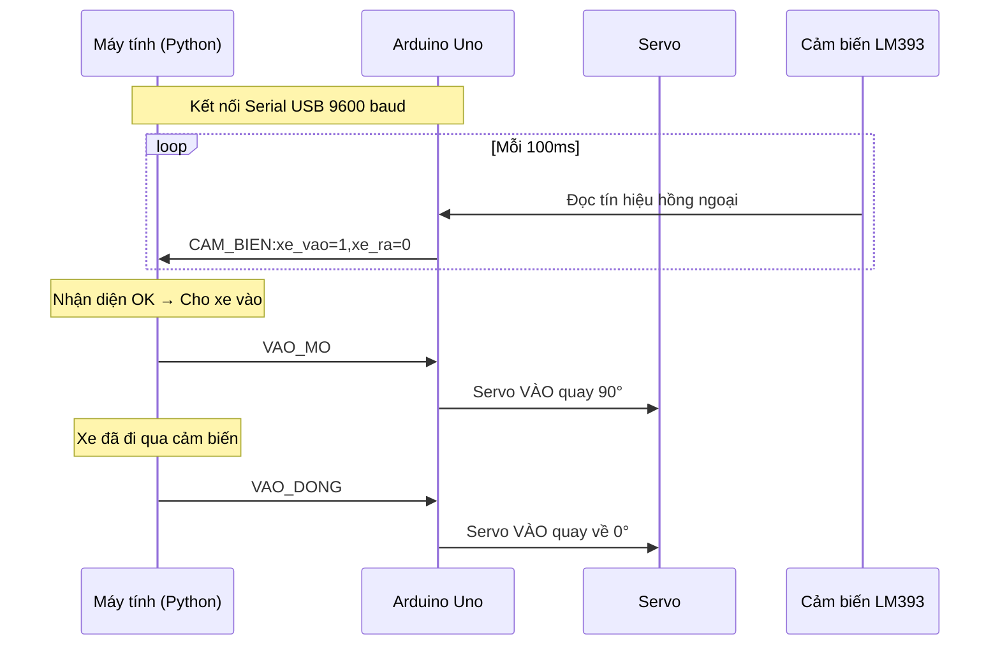

---

## 8. TỔNG KẾT

### 8.1. Kết quả đánh giá

| Chỉ số | Giá trị |
|--------|---------|
| Độ chính xác nhận diện biển số (200 ảnh test) | **97.5%** |
| Độ chính xác ký tự (1600 ký tự) | **99.3%** |
| YOLO mAP50 | **99.48%** |
| Thời gian xử lý trung bình | **0.3–0.6 giây** |

### 8.2. Điểm mạnh kiến trúc

1. **Kiến trúc lỏng (Decoupled):** UI và luồng xử lý nặng (AI, Camera) không nằm chung luồng. Dù AI treo hay Camera giật, người dùng vẫn tương tác bình thường.
2. **Phòng ngừa lỗi (Fault-Tolerance):** Xử lý đứt Serial, thiếu thư viện AI (báo lỗi không crash), warm-up AI (tránh lag lượt đầu tiên).
3. **An toàn phần cứng:** Cảm biến đóng vai trò quyết định, barie luôn ưu tiên "an toàn cho phương tiện" hơn "đóng đúng giờ".
4. **Pipeline AI 3 phiên bản:** Tăng độ chính xác trong nhiều điều kiện ánh sáng khác nhau.

### 8.3. Hạn chế và hướng phát triển

| Hạn chế | Hướng phát triển |
|---------|-----------------|
| Chỉ chạy standalone 1 máy | Chuyển sang kiến trúc client-server (Web API) |
| Sử dụng CPU | Tận dụng GPU hoặc edge device |
| Chưa hỗ trợ biển ngoại giao, quân đội | Mở rộng regex và bảng sửa lỗi |
| Cổng RA không nhận diện (FIFO) | Thêm camera cổng RA để đối chiếu |
| SQLite đơn luồng | Nâng cấp PostgreSQL cho đa người dùng |
