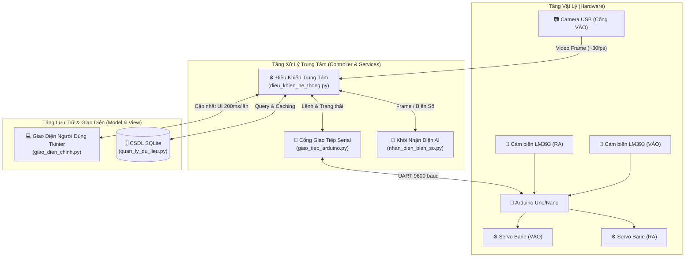

# Sơ Đồ Khối Tổng Thể Hệ Thống Bãi Xe Tự Động

Tài liệu này mô tả sơ đồ khối kiến trúc tổng thể của hệ thống, bao gồm 3 tầng chính: Tầng Vật Lý, Tầng Xử Lý Trung Tâm và Tầng Lưu Trữ & Giao Diện.

## Phân tích các khối chức năng chính:

1. **Tầng Vật Lý (Hardware):**
   - Đảm nhận việc thu thập hình ảnh từ Camera.
   - Phát hiện tín hiệu xe vào/ra qua cảm biến LM393.
   - Arduino đóng vai trò là mạch vi điều khiển trung gian, nhận tín hiệu cảm biến và thực thi các lệnh vật lý (đóng/mở Servo Barie).

2. **Tầng Xử Lý Trung Tâm (Controller & Services):**
   - Đóng vai trò là "bộ não" (Controller) điều phối toàn bộ các tiến trình hệ thống.
   - Lấy luồng video (stream) từ Camera và gửi cho mô-đun AI (`nhan_dien_bien_so.py`) để nhận diện biển số xe bằng YOLOv8 và PaddleOCR.
   - Giao tiếp hai chiều với Arduino qua giao thức PySerial (`giao_tiep_arduino.py`) để thu thập trạng thái cảm biến và ra lệnh đóng/mở cửa tương ứng.

3. **Tầng Lưu Trữ & Giao Diện (Model & View):**
   - `giao_dien_chinh.py`: Chịu trách nhiệm hiển thị thông tin lên màn hình cho người dùng (UI) và nhận thao tác điều khiển.
   - `quan_ly_du_lieu.py`: Truy vấn, lưu trữ dữ liệu xe ra/vào xuống cơ sở dữ liệu SQLite, giúp lưu trữ lịch sử và quản lý danh sách xe một cách an toàn thông qua cơ chế chống xung đột đa luồng (Thread-safe Lock).
