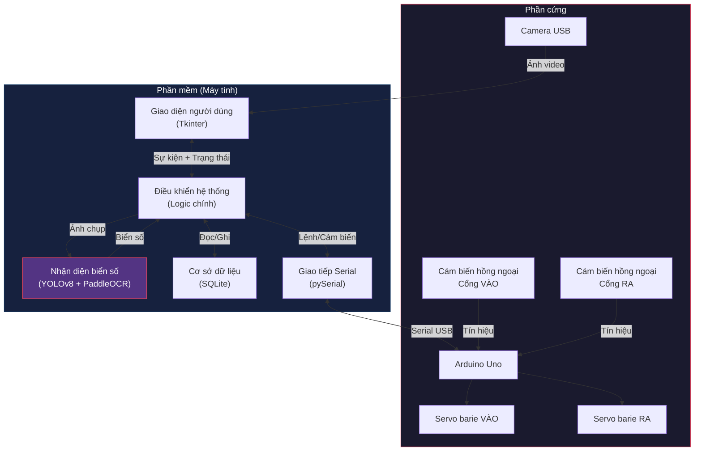
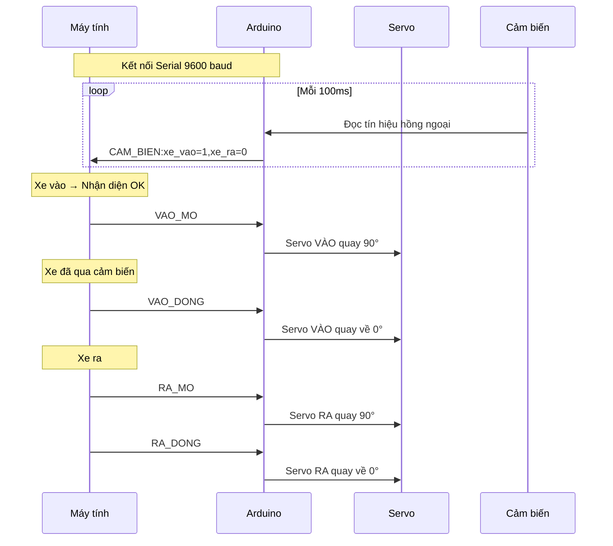

# Sơ Đồ Khối & Lưu Đồ Thuật Toán — Hệ Thống Quản Lý Bãi Đỗ Xe Tự Động

## 1. Sơ đồ khối tổng quan hệ thống



---

## 2. Sơ đồ khối các module phần mềm

```mermaid
graph LR
    
<truncated 7819 bytes>
ch:** Hệ thống sử dụng 4 luồng (thread) chạy song song để tránh giao diện bị đơ:
> - **Main Thread**: Vòng lặp Tkinter, cập nhật giao diện
> - **Camera Reader**: Đọc ảnh từ camera liên tục
> - **AI Worker**: Chạy nhận diện (nặng nhất, ~0.3-0.6s)
> - **Sensor Worker**: Đọc cảm biến Arduino mỗi 100ms

---

## 9. Sơ đồ cơ sở dữ liệu (ERD)

```mermaid
erDiagram
    BIEN_SO_HOP_LE {
        text bien_so PK "Biển số xe (VD: 51F32488)"
        text chu_xe "Tên chủ xe (tùy chọn)"
        text tao_luc "Thời gian thêm"
    }

    XE_TRONG_BAI {
        text bien_so PK "Biển số xe"
        text vao_luc "Thời gian vào bãi"
    }

    CAI_DAT {
        text khoa PK "Tên cài đặt"
        text gia_tri "Giá trị (VD: suc_chua = 3)"
    }

    BIEN_SO_HOP_LE ||--o{ XE_TRONG_BAI : "Xe hợp lệ mới được vào"
```

---

## 10. Sơ đồ giao thức Serial (Arduino)


