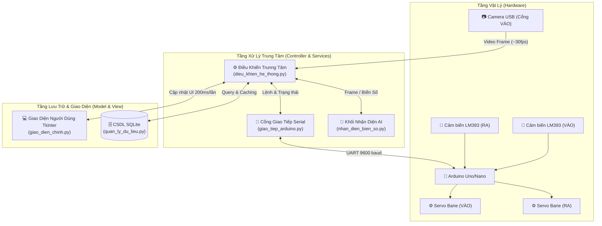
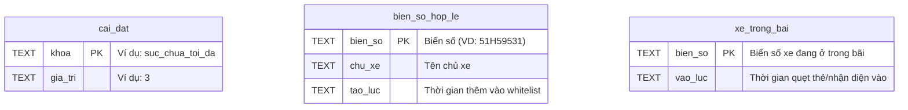
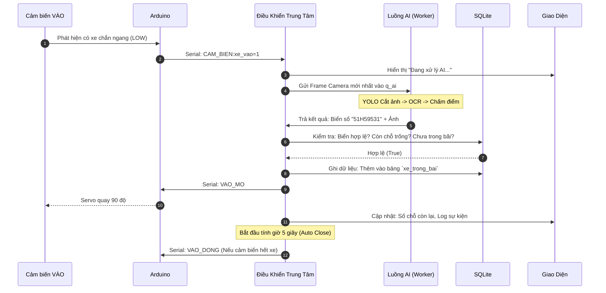
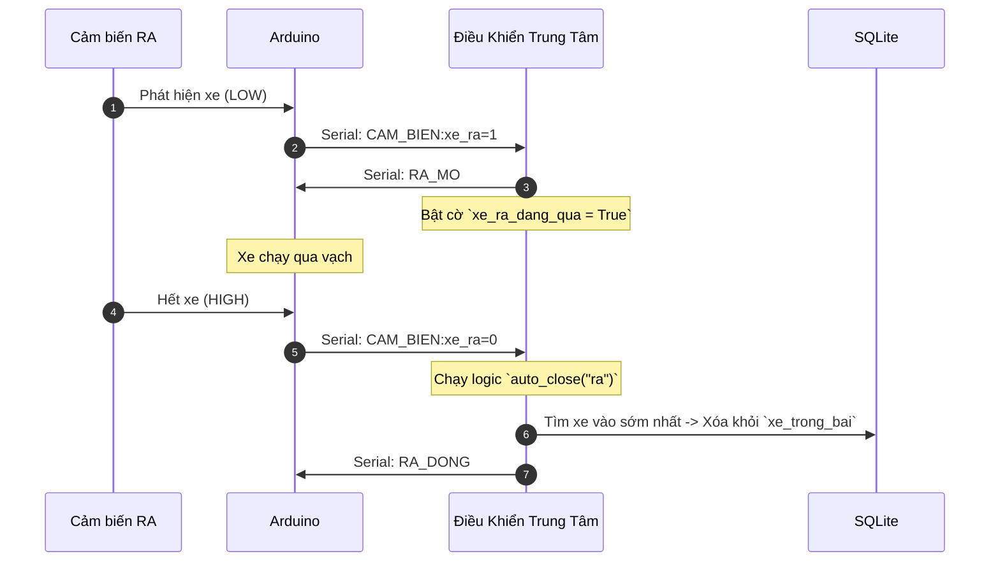
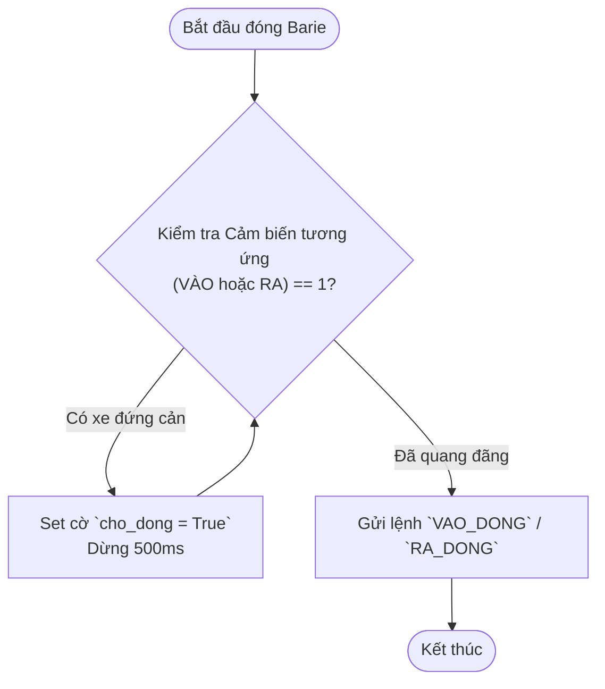
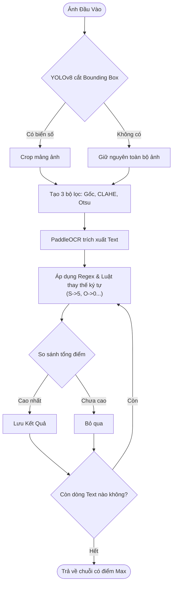

# TỔNG QUAN KIẾN TRÚC & NGUYÊN LÝ HOẠT ĐỘNG
**Đề tài:** Hệ Thống Bãi Xe Tự Động Ứng Dụng Nhận Diện Biển Số

Tài liệu này là bản báo cáo rà soát toàn diện nhất về toàn bộ cấu trúc, luồng dữ liệu, cơ sở dữ liệu và thuật toán của hệ thống, dựa trên mã nguồn thực tế trong thư mục dự án.

---

## 1. Kiến Trúc Hệ Thống Tổng Thể

Hệ thống được thiết kế theo mô hình phân tán cục bộ, chia làm 3 lớp (Tầng Vật Lý - Tầng Xử Lý Trung Tâm - Tầng Lưu Trữ/Giao Diện). Mẫu thiết kế phần mềm (Software Design Pattern) được sử dụng là **MVC (Model - View - Controller)** kết hợp **Đa luồng (Multi-threading)**.

### Sơ Đồ Khối Tổng Thể (Block Diagram)

---

## 2. Phân Tích Cơ Sở Dữ Liệu (Database Schema)

Hệ thống sử dụng **SQLite** lưu tại file `co_so_du_lieu_bai_xe.db` để đảm bảo tính gọn nhẹ, không cần cài đặt SQL Server.

### Biểu Đồ Quan Hệ Thực Thể (ERD)

**Đặc tính kỹ thuật DB:**
- CSDL được quản lý bởi file `quan_ly_du_lieu.py`. 
- Để tránh nghẽn cổ chai (bottleneck) khi UI và AI cùng truy xuất, toàn bộ thao tác CSDL được bọc trong `threading.Lock()`.
- Lớp Controller lưu một biến cờ (flag) gọi là **DB Cache**. Nếu không có xe nào chạy ra/vào, hệ thống sẽ trả về data từ RAM thay vì đọc ổ cứng, giúp phần mềm chạy siêu nhẹ.

---

## 3. Cấu Trúc Mã Nguồn (Directory Structure)

Dự án gồm **5 file Python** và **1 file C++ (Arduino)**:

| File | Vai Trò | LoC (Dòng lệnh) | Đặc điểm nổi bật |
|------|---------|-----------------|------------------|
| `giao_dien_chinh.py` | View (UI) | ~493 | Tkinter grid, Polling 200ms, Graceful Shutdown. |
| `dieu_khien_he_thong.py` | Controller | ~448 | Quản lý Queue, điều phối 3 Thread (AI, Sensor, Camera), Auto-close Logic. |
| `nhan_dien_bien_so.py` | AI Service | ~305 | YOLOv8 + PaddleOCR + Heuristics sửa lỗi biển VN. |
| `quan_ly_du_lieu.py` | Model (DB) | ~110 | Thao tác SQLite có Thread-Safe Lock. |
| `giao_tiep_arduino.py` | HW Service | ~95 | PySerial, tự quét cổng COM, chống nhiễu đứt cáp (RLock). |
| `dieu_khien_barie...ino` | Firmware | ~150 | Chống dội cảm biến LM393 (Debounce), điều khiển góc Servo. |

---

## 4. Nguyên Lý Hoạt Động & Luồng Dữ Liệu (Data Flow)

### 4.1 Luồng Tự Động: Xe VÀO bãi

Đây là luồng phức tạp nhất, liên quan đến cả Phần cứng, Nhận diện hình ảnh và CSDL.

### 4.2 Luồng Tự Động: Xe RA khỏi bãi

Cổng ra không có Camera, chỉ dùng Cảm biến để mở cửa (do hệ thống quản lý một chiều số lượng).

---

## 5. Lưu Đồ Thuật Toán Trọng Tâm

### 5.1 Lưu Đồ Kỹ Thuật Đóng Barie An Toàn (Anti-Pinch)
Hệ thống KHÔNG đóng barie mù quáng sau 5 giây. Nó có cơ chế chống kẹp xe cực kỳ chặt chẽ:

### 5.2 Lưu Đồ Giải Thuật Nhận Diện AI
Module `nhan_dien_bien_so.py` được thiết kế để không bỏ lỡ bất kỳ dữ liệu nào ngay cả trong môi trường thiếu sáng.

---

## 6. Tổng Kết Kiến Trúc

Dự án này là một hệ thống mang tính chuyên nghiệp nhờ 3 đặc điểm:
1. **Decoupled Architecture (Kiến trúc lỏng):** Giao diện (UI) và Luồng xử lý nặng (AI, Camera) không nằm chung luồng. Dù AI có bị treo hoặc Camera bị giật, người dùng vẫn bấm được các nút trên màn hình bình thường.
2. **Phòng Ngừa Lỗi (Fault-Tolerance):** Code xử lý đứt dây Serial (cắm lại nhận luôn), lỗi thư viện AI (Graceful degradation - báo thiếu thư viện chứ không crash), và cơ chế Warm-up AI (Chống lag lượt xe đầu tiên).
3. **Logic Phần Cứng An Toàn:** Cảm biến đóng vai trò quyết định, barie luôn ưu tiên "an toàn cho phương tiện" hơn là "đóng đúng giờ".
